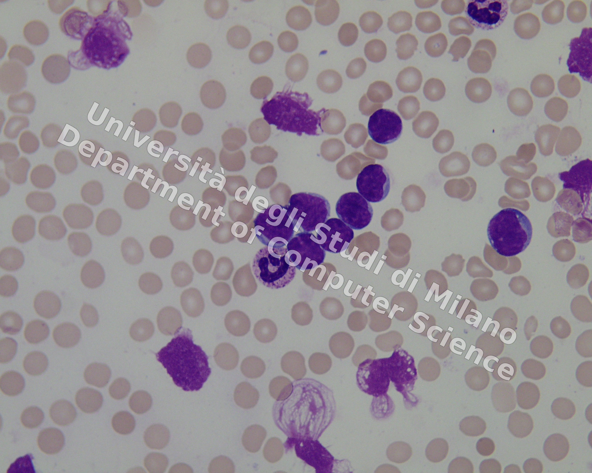
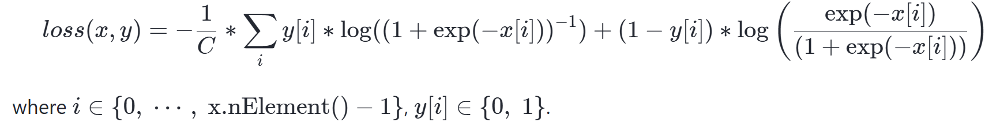

# I2MTC 2026 Tutorial: AI for Whole Slide Imaging and ALL Detection

This repository contains the hands-on code for the **I2MTC 2026 tutorial**:

> **Artificial Intelligence for Whole Slide Imaging: Application to Acute Lymphoblastic Leukemia Detection**  
> Instructor: **Angelo Genovese**  
> Università degli Studi di Milano, Department of Computer Science

The tutorial shows how to process Whole Slide Images (WSIs) of blood tissue, split them into labeled patches, train a deep-learning classifier, interpret predictions with Grad-CAM, and map detected blast locations back to the original WSI coordinate system.

The main executable material is the notebook:

```text
im2tc26_tutorial_Genovese.ipynb
```

---

## Tutorial Scope

The tutorial focuses on **Acute Lymphoblastic Leukemia (ALL) detection** using deep learning and WSI processing.

The practical objective is to classify white blood cells as:

```text
Class 0: probable ALL lymphoblast / blast
Class 1: white blood cell not a probable lymphoblast / normal
```

The labels are treated as **multi-label**, because a patch may contain more than one white blood cell type.

---

## Example Whole Slide Image

The repository includes example WSIs and annotation files in the `WSIs/` folder.



The corresponding centroid annotations are stored in:

```text
WSIs/positions/
```

Each annotation file contains blast and normal-cell centroid coordinates.

---

## Repository Structure

```text
.
├── README.md
├── im2tc26_tutorial_Genovese.ipynb
├── WSIs/
│   ├── Im001_1.jpg
│   ├── Im002_1.jpg
│   ├── Im003_1.jpg
│   └── positions/
├── classes/
│   ├── classesADP.py
│   └── classesALL.py
├── functions/
│   ├── train_model_val.py
│   ├── utils.py
│   └── warmup.py
├── imgs/
│   └── mlloss.png
├── modelGeno/
│   └── resnet_geno.py
├── pretrained_nets/
│   └── adp/
│       ├── resnet18/
│       └── resnet34/
└── util/
    ├── accuracy.py
    ├── computeClassWeights.py
    ├── computeMeanStd.py
    ├── dbToDataStore.py
    ├── getClassCount.py
    ├── imshow.py
    ├── normImageCustom.py
    ├── normImageTo255.py
    ├── print_pers.py
    └── visImage.py
```

### Main components

| Path | Purpose |
|---|---|
| `im2tc26_tutorial_Genovese.ipynb` | Main tutorial notebook. It walks through WSI display, annotations, patch extraction, training, evaluation, and Grad-CAM localization. |
| `WSIs/` | Example WSI images used in the tutorial. |
| `WSIs/positions/` | Centroid annotations for blasts and normal white blood cells. |
| `classes/` | Class definitions for ALL and auxiliary/pretraining classes. |
| `functions/` | Training utilities, warmup routine, validation training loop, and orthogonality-related utilities. |
| `modelGeno/` | Custom ResNet definitions used by the tutorial. |
| `pretrained_nets/adp/` | Pretrained ResNet18 and ResNet34 folders used for histopathological transfer learning. |
| `util/` | General utilities for normalization, class weights, accuracy, visualization, and datastore creation. |
| `imgs/` | Figures used in the notebook/README. |

---

## Tutorial Workflow

The notebook is organized as a full pipeline.

```text
WSI images + centroid annotations
        ↓
Display WSI and overlay annotations
        ↓
Split WSIs into overlapping patches
        ↓
Assign multi-label patch targets
        ↓
Create train/validation/test datastores
        ↓
Compute normalization and class weights
        ↓
Warm up the classifier
        ↓
Fine-tune CNN models
        ↓
Tune the decision threshold on validation data
        ↓
Evaluate on the test set
        ↓
Use Grad-CAM to localize blast evidence
        ↓
Map Grad-CAM centroids back to WSI coordinates
```

---

## Part 1 — Handle Whole Slide Images

The first part of the notebook loads the example WSIs and their centroid annotations.

The annotation files list cell centroids grouped into:

```text
blasts
x y
x y
...
normal
x y
x y
...
```

The notebook then overlays these centroids on the original WSI to visualize the available supervision.

---

## Part 2 — Split WSIs into Patches

The notebook splits each WSI into overlapping patches.

Default patching parameters:

```python
PATCH_SIZE = 256
OVERLAP_PCT = 0.25
PIXEL_TOLL = 5
```

For each patch, the code checks whether blast or normal-cell centroids fall inside the patch boundaries, using a small tolerance to account for the irregular shape of white blood cells.

Generated patches and metadata are stored in a folder named like:

```text
patches_256_overlap_0.25_toll_5/
```

Patch metadata are saved in:

```text
patches_256_overlap_0.25_toll_5/info/
```

The patch metadata are important because they allow local patch coordinates to be mapped back to original WSI coordinates.

---

## Part 3 — Model Training

The tutorial trains CNN models for multi-label patch classification.

Main training features:

- PyTorch-based training loop
- optional classifier warmup
- AdamW optimizer
- cosine learning-rate scheduling
- class-weighted `BCEWithLogitsLoss`
- optional orthogonality regularization for ResNet models
- checkpointing during training
- best-model selection on validation metrics

The relevant source files are:

```text
functions/warmup.py
functions/train_model_val.py
functions/utils.py
modelGeno/resnet_geno.py
util/computeClassWeights.py
util/computeMeanStd.py
```

---

## Multi-label Loss

The tutorial uses a multi-label formulation because a patch may contain both a blast and a normal white blood cell.



A typical loss setup is:

```python
criterion = torch.nn.BCEWithLogitsLoss(pos_weight=weightsBCE.float().to(device))
```

The model outputs raw logits, and sigmoid activations are applied only when converting outputs to probabilities or binary predictions.

---

## Histopathological Transfer Learning

The repository includes support for histopathology-oriented transfer learning using pretrained ResNet models.

Relevant folders:

```text
pretrained_nets/adp/resnet18/
pretrained_nets/adp/resnet34/
```

The tutorial can use these models as a starting point before fine-tuning on ALL patch classification.

---

## Threshold Tuning

For multi-label classification, using a fixed threshold of `0.5` may not be optimal.

The recommended protocol is:

```text
train set       → train model
validation set  → tune threshold
test set        → final evaluation with fixed threshold
```

The notebook can collect validation probabilities, search for the best threshold using Jaccard score or F1-score, and then apply the selected threshold to the test set.

This avoids tuning on the test set and keeps the final evaluation unbiased.

---

## Evaluation Metrics

The project reports metrics suitable for multi-label classification, including:

- `1 - Hamming Loss`
- Jaccard score
- precision
- recall
- F1-score
- `classification_report` from scikit-learn

For multi-label problems, `1 - Hamming Loss` should not be the only reported metric, because it can look high when negative labels dominate. Jaccard and F1 provide a clearer view of overlap quality.

---

## Grad-CAM Localization

After training, the tutorial applies Grad-CAM to identify the image regions that drive the blast prediction.

The localization workflow is:

1. Load a patch.
2. Create a normalized tensor for model inference.
3. Create a non-normalized tensor for visualization.
4. Apply Grad-CAM to the blast class.
5. Convert the heatmap into an intensity map.
6. Keep the most relevant connected component.
7. Compute the intensity-weighted centroid.
8. Map the centroid from patch coordinates back to WSI coordinates.
9. Save the predicted blast coordinates to CSV.

The output format is:

```text
wsi_id,patch_name,cx_wsi,cy_wsi
```

Example:

```text
Im001_1,Im001_1_patch_14,12345.67,8901.23
```

---

## Installation

### Option 1 — pip

```bash
python -m venv .venv
source .venv/bin/activate
pip install -r requirements.txt
```

### Option 2 — Conda

```bash
conda env create -f environment.yml
conda activate i2mtc2026
python -m ipykernel install --user --name i2mtc2026 --display-name "Python (i2mtc2026)"
```

Typical dependencies include:

```text
numpy
pandas
Pillow
matplotlib
scikit-learn
scikit-image
torch
torchvision
jupyter
ipykernel
```

The Grad-CAM code in the original notebook uses the older import style:

```python
from gradcam.utils import visualize_cam
from gradcam import GradCAM
```

Make sure the environment includes a package or local module exposing this API.

---

## Running the Tutorial

Start Jupyter and open the notebook:

```bash
jupyter notebook im2tc26_tutorial_Genovese.ipynb
```

or, in VS Code, open:

```text
im2tc26_tutorial_Genovese.ipynb
```

Then select the correct Python kernel/environment.

The notebook is intended to be executed section by section:

1. load WSIs;
2. display annotations;
3. extract patches;
4. prepare the dataset;
5. train or load a model;
6. tune thresholds;
7. evaluate results;
8. generate Grad-CAM maps;
9. map detections back to WSI space.


---

## Disclaimer

This repository is intended for research, teaching, and tutorial use. It is not a clinical diagnostic tool. Any medical application requires expert validation, appropriate regulatory review, and clinical evaluation.


## References and Project Pages

Relevant tutorial title:

```text
Artificial Intelligence for Whole Slide Imaging: Application to Acute Lymphoblastic Leukemia Detection
I2MTC 2026 Tutorial
Instructor: Angelo Genovese
Università degli Studi di Milano
```

This tutorial is based on the following research works and resources.

### Papers

1. A. Genovese, V. Piuri, F. Scotti,  
   **"ALL-IDB Patches: Whole slide imaging for Acute Lymphoblastic Leukemia detection using Deep Learning,"**  
   in *Proc. of the IEEE International Conference on Acoustics Speech and Signal Processing Workshops (ICASSPW 2023)*,  
   Rhodes Island, Greece, pp. 1–5, June 4–10, 2023.  
   ISBN: 979-8-3503-0261-5.  
   DOI: [10.1109/ICASSPW59220.2023.10193429](https://doi.org/10.1109/ICASSPW59220.2023.10193429)

2. R. Donida Labati, V. Piuri, F. Scotti,  
   **"ALL-IDB: the acute lymphoblastic leukemia image database for image processing,"**  
   in *Proc. of the 2011 IEEE International Conference on Image Processing (ICIP 2011)*,  
   Brussels, Belgium, pp. 2045–2048, September 11–14, 2011.  
   ISBN: 978-1-4577-1302-6.  
   DOI: [10.1109/ICIP.2011.6115881](https://doi.org/10.1109/ICIP.2011.6115881)
   
3. A. Genovese, M. S. Hosseini, V. Piuri, K. N. Plataniotis, and F. Scotti,  
    **"Histopathological transfer learning for Acute Lymphoblastic Leukemia detection,"**  
    in *Proc. of the 2021 IEEE International Conference on Computational Intelligence and Virtual Environments for Measurement Systems and Applications (CIVEMSA 2021)*,  
    pp. 1–6, June 18–20, 2021.  
    ISBN: 978-1-6654-1249-0.  
    DOI: [10.1109/CIVEMSA52099.2021.9493677](https://doi.org/10.1109/CIVEMSA52099.2021.9493677)

### Project Pages

- [CNN-based ALL detection project page](https://iebil.di.unimi.it/cnnALL/index.htm)
- [ALL-IDB dataset project page](https://scotti.di.unimi.it/all/)

---

## BibTeX

```bibtex
@inproceedings{genovese2023allidbpatches,
  author    = {Genovese, Angelo and Piuri, Vincenzo and Scotti, Fabio},
  title     = {{ALL-IDB Patches: Whole Slide Imaging for Acute Lymphoblastic Leukemia Detection Using Deep Learning}},
  booktitle = {Proceedings of the IEEE International Conference on Acoustics, Speech and Signal Processing Workshops (ICASSPW 2023)},
  pages     = {1--5},
  address   = {Rhodes Island, Greece},
  month     = jun,
  year      = {2023},
  isbn      = {979-8-3503-0261-5},
  doi       = {10.1109/ICASSPW59220.2023.10193429}
}

@inproceedings{donidalabati2011allidb,
  author    = {Donida Labati, Ruggero and Piuri, Vincenzo and Scotti, Fabio},
  title     = {{ALL-IDB: The Acute Lymphoblastic Leukemia Image Database for Image Processing}},
  booktitle = {Proceedings of the 2011 IEEE International Conference on Image Processing (ICIP 2011)},
  pages     = {2045--2048},
  address   = {Brussels, Belgium},
  month     = sep,
  year      = {2011},
  isbn      = {978-1-4577-1302-6},
  doi       = {10.1109/ICIP.2011.6115881}
}

@inproceedings{genovese2021histopathological,
  author    = {Genovese, Angelo and Hosseini, Mahdi S. and Piuri, Vincenzo and Plataniotis, Konstantinos N. and Scotti, Fabio},
  title     = {{Histopathological Transfer Learning for Acute Lymphoblastic Leukemia Detection}},
  booktitle = {Proceedings of the 2021 IEEE International Conference on Computational Intelligence and Virtual Environments for Measurement Systems and Applications (CIVEMSA 2021)},
  pages     = {1--6},
  month     = jun,
  year      = {2021},
  isbn      = {978-1-6654-1249-0},
  doi       = {10.1109/CIVEMSA52099.2021.9493677}
}

